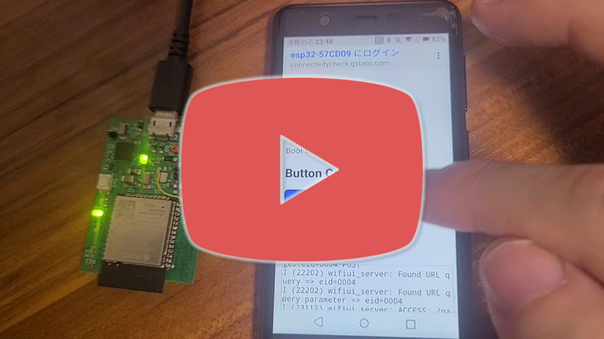
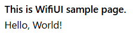
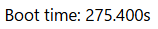
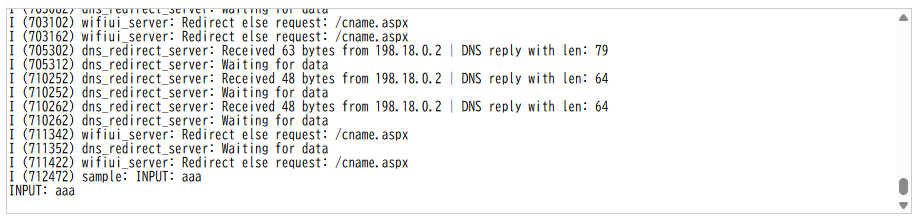
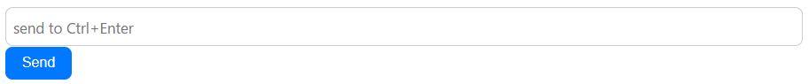
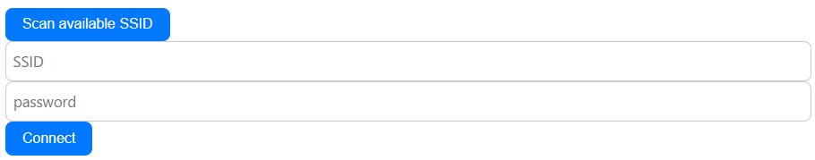
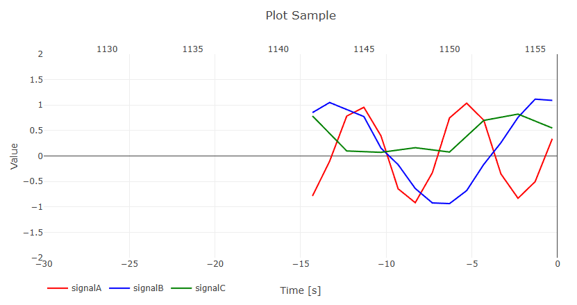
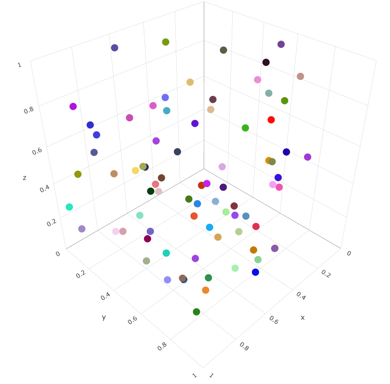

# WifiUIとは？

Wifi経由で開けるESP32のGUI
- ESP32のアクセスポイントにスマホやPCを接続することでブラウザでUIにアクセス可能  
つまり物理的な配線なしでインタラクティブなESP32 GUIを提供する
- さらにESP32を子機としてインターネットに接続し、ルーティングを適切に設定すれば、ネット経由でそのUIにアクセスすることも可能


## 機能紹介

[](https://youtu.be/zH2t_q2wEK8)

動画では以下の要素を紹介しています。  
- 静的テキスト  
- 動的テキスト
- ボタン（例としてLEDのON/OFF）
- メッセージログ
- テキスト入力
- STAモードでのルータ接続フォーム
- 動的グラフ
    - 時系列グラフ
    - 散布図（X-Yグラフ）
    - 3D散布図

## スマホ/PC等からのUI起動方法

1. WifiUIをFlashしたESP32を起動する
1. クライアントになる端末（Wifi機能を備えたPCやスマホ）で「利用可能なWifiネットワーク」などから **esp32-XXXXXX**（XXXXXXはESP32のMACアドレス下6桁）もしくは指定されたSSIDに接続する  
    
1. 同じページや通知に現れる「ネットワークにサインイン」を選択  
    機種によってはこの操作は不要なこともある。（iOSやWindowsは不要だった）  
    
    
1. OS内蔵ブラウザでUIが立ち上がる  
    

## TODO
- 複数NICを持ちすでにインターネットに接続したクライアント端末でのUIへのアクセス方法
- 複数クライアント接続対応
- element構造体のconst指定

# デベロッパーマニュアル
## 開発環境
- VS Code
    - ESP-IDF V5.4.1 Extension (詳細はRADECHのドキュメント、もしくは[ESP32S3_helloworld](https://github.com/lelt0/ESP32S3_helloworld)を参照)    
    できるだけアプリサイズを小さくしたかったので（このWifiUIはメイン機能というよりサブ機能なので）、ArduinoライブラリではなくEPS-IDFベースで作成した。  
    以下のモジュールを使用した。
        - [HTTP Server](https://docs.espressif.com/projects/esp-idf/en/stable/esp32/api-reference/protocols/esp_http_server.html)
        - [Wi-Fi](https://docs.espressif.com/projects/esp-idf/en/stable/esp32/api-reference/network/esp_wifi.html)
- ESP32
    無印もしくはS3で動作確認

## UIの作成方法
サンプルの実装は`main/main.c`を参照。  

UIは複数のページ（page）とそのページ内に配置される要素（element）からなる。  


1. ページ（page）の作成  
    `wifiui_create_page()`でページを作成しpage構造体ポインタを取得
    ```c
    #include "wifiui_server.h"
    wifiui_page_t* page = wifiui_create_page("This is Page title");
    ```
1. 要素（element）の作成  
    1. `wifiui_element_button()`などの関数でelement構造体ポインタを取得  
    （各element詳細は[element一覧](#element一覧)を参照）  
    1. `wifiui_add_element()`でelementをpageに登録  
    ```c
    #include "wifiui_element_button.h"
    wifiui_add_element(page, (const wifiui_element_t*) wifiui_element_button("button text", click_callback, click_callback_param));
    ```
1. WifiUIの開始
    `wifiui_start()`でUIを開始。このときアクセスポイントのSSIDとパスワード、そしてトップページとなるpageを指定する。
    ```c
    wifiui_start("ssid", "password", top_page);
    ```

### element一覧
#### 見出し
H1～H6の見出しを表示する
```c
#include "wifiui_element_heading.h"
wifiui_add_element(top_page, (const wifiui_element_t*) wifiui_element_heading("WifiUI Sample", 1));
```


#### 静的テキスト  
固定テキストを表示する  
- HTMLタグが使用可能  
```c
#include "wifiui_element_stext.h"
wifiui_add_element(top_page, (const wifiui_element_t*) wifiui_element_static_text("<b>This is WifiUI sample page.</b>\nHello, World!"));
```


#### 動的テキスト
動的に内容を変更できるテキストを表示する
```c
#include "wifiui_element_dtext.h"
const wifiui_element_dtext_t* dtext_time = NULL;
wifiui_add_element(top_page, (const wifiui_element_t*) (dtext_time = wifiui_element_dynamic_text("Boot time: --")));

if(dtext_time != NULL)
{
    char update_text[64];
    snprintf(update_text, 32, "Boot time: %6.3lfs", time);
    dtext_time->change_text(dtext_time, update_text);
}
```


#### ボタン
クリック可能なボタンを配置する
```c
#include "wifiui_element_button.h"

void click_callback(const wifiui_element_button_t * dummy, void* arg){ ... }
wifiui_add_element(top_page, (const wifiui_element_t*) wifiui_element_button("Toggle LED", click_callback, NULL));
```


#### リンク
ほかのpageにアクセスするリンクテキストを配置する
```c
#include "wifiui_element_link.h"
wifiui_add_element(top_page, (const wifiui_element_t*) wifiui_element_link("goto time-plot sample page", timeplot_page));
```


#### メッセージログ
ESPから送信されるメッセージの受信ログを配置する
- オプションとして`ESP_LOG()`系マクロのコピーログを作成することができる
```c
#include "wifiui_element_message_log.h"
const wifiui_element_msglog_t* msglog = NULL;
wifiui_add_element(top_page, (const wifiui_element_t*) (msglog = wifiui_element_message_log(true)));

if(msglog != NULL) msglog->print_message(msglog, "INPUT: aaa");
```


#### テキスト入力
複数行テキストを入力しESPに送信するフォームを作成する
- 送信はボタンクリックのほかにCtrl+Enterでも可能
```c
#include "wifiui_element_input.h"
void input_callback(char* str, void* param){ ... }
wifiui_add_element(top_page, (const wifiui_element_t*) wifiui_element_input("Send", input_callback, NULL, NULL, true));
```


#### STAモードでのルータ接続フォーム
ESPがクライアントとしてルータなどに接続するためのSSID・パスワード入力フォームを配置する
- 「Scan available SSID」ボタンで利用可能なSSIDをスキャン可能
```c
#include "wifiui_element_ap_connect_form.h"
void connected_callback(uint32_t ip_addr){ ... }
wifiui_add_element(top_page, (const wifiui_element_t*) wifiui_element_ap_connect_form(connected_callback));
```


#### 時系列グラフ
リアルタイムで更新される時系列グラフを配置する
- 横軸の時間スケールを指定可能
- 縦軸のスケールを指定可能（自動スケールも利用可能）
```c
#include "wifiui_element_timeplot.h"
#include "math.h"
const wifiui_element_timeplot_t* timeplot = NULL;
wifiui_add_element(timeplot_page, (const wifiui_element_t*) (timeplot = wifiui_element_timeplot("Plot Sample", 3, (char*[]){"signalA", "signalB", "signalC"}, "Value", -2, 2, 30)));

// 全signal更新（NAN指定で更新から除外）
timeplot->update_plots(timeplot, time_ms, (float[]){val1, val2, NAN});
// signal名を指定して更新
timeplot->update_plot(timeplot, "signalC", time_ms, val3);
```


#### 散布図（X-Yグラフ）
リアルタイムで更新可能なX-Yグラフを配置する
- 複数データの描画に対応
- 点間に線を描画するかをデータごとにオプションで指定可能
```c
#include "wifiui_element_scatterplot.h"
const wifiui_element_scatterplot_t* scatterplot = NULL;
wifiui_add_element(scatter_page, (const wifiui_element_t*) (scatterplot = wifiui_element_scatterplot("Scatter Sample", "x", 0, 0, "y", 0, 0)));

if(scatterplot != NULL)
{
    ...
    scatterplot->add_plot(scatterplot, "sample-1", point_count, x, y, true);
}
```


#### 3D散布図
リアルタイムで更新可能な3D散布図を配置する（試験実装）
- (x, y, z)とcolorを指定可能
```c
#include "wifiui_element_scatter3d_plot.h"
const wifiui_element_scatter3dplot_t* scatter3dplot = NULL;
wifiui_add_element(scatter3d_page, (const wifiui_element_t*) (scatter3dplot = wifiui_element_scatter3d_plot("Plot Sample", 0, 1, 0, 1, 0, 1)));

if(scatter3dplot != NULL)
{
    ...
    scatter3dplot->update_plot(scatter3dplot, point_count, x, y, z, color);
}
```


## ビルド方法

1. `idf.py menuconfig`でWebSocketを有効化する > 詳細：[ESP-IDFでWebSocket有効化](#ESP32での実装方法)
1. `idf.py menuconfig`でRequest Header 拡張  
    これをしないと一部のAndroidスマホからのレスポンスが「Header fields are too long」としてESPサーバが怒ってくる
    1. `idf.py menuconfig`
    1. `Max HTTP Request Header Length`を1024に  
        
1. `idf.py menuconfig`でSPIFFSパーティションサイズ等設定 > 詳細：[SPIFFSへの書き込み・読み出し](#SPIFFSへの書き込み・読み出し)
    - 特に最初のビルドでは、プロジェクトルートのCMakeLists.txtで、`FLASH_IN_PROJECT`を有効にする
1. 普通にビルド＆Flash（`idf.py build flash`）


# 内部仕様

## 全体シーケンス


## キャプティブポータル
特に公衆Wi-Fiなどのネットワークに接続したときに、インターネットアクセスの前にユーザーにログインや同意を求めるWebページを表示する仕組み。  
WifiUIではこのキャブティブポータルで自動でOSのミニブラウザが特定のURIにアクセスする仕組みを利用し、  
ユーザがIPアドレスを直接ブラウザに打ち込まなくてもESP32のUIにアクセスできる仕組みを作った

### 実装のポイント
Captive PortalはOSが自動的にインターネットへのアクセスを試行し、インターネット接続できなければリダイレクトされたページを(ミニ)ブラウザで表示する。  
つまり、基本的には
- ESP32内のDNSサーバで任意のドメインをESP32のアクセスポイントIPとして解決させること
- ESP32内のHTTPサーバで予期しないURIへのアクセスをすべて用意したポータルサイト（index.htmlなど）にリダイレクトすること  

ができればCaptive Portalを実現できる。

ただし、このインターネットアクセス試行先URLや「インターネットに繋がった」とみなす判定方法がOS（もしくはベンダー）ごとに異なるのがクセモノ。  
以下に自分のほうで調べたものも含め、各OSの挙動を示す。

- **Google Android, ChromeOSの場合（主にGoogle製のもの）：**  
`http://connectivitycheck.gstatic.com/generate_204`にアクセス可能かでインターネット接続を判定する。  
もしインターネット接続できている場合はこのページが`204 No Content`を返すので、その場合はキャプティブポータル無しと判断する。
    - **Samsungスマートフォン：**  
    これがクセが強く、リダイレクトするIPアドレスが192.168.xxx.xxxなどのprivate IPだとCaptive Portalと認識してくれず、「接続が不安定」などと表示されブラウザが自動で起動しない。  
    対策としてはpublicなIPアドレスを指定する必要がある。
        - しかし愚直にpublicなIPアドレスを指定すると、複数のNICを持つデバイスで1つのネットワークインターフェース（NI）でインターネットに、もうひとつのNIでESP32に接続した場合、publicなIPアドレスをネットにつながった方のNIで解決しようとするのでESP32のUIページに誘導できない問題がある。  
        （そもそもCaptivePortalはインターネットアクセスを承認するための仕組みなので、インターネットに接続できているならPortalページを開く必要がないのは正しい挙動なのだが…）
        なのでこのケースではクライアント端末側で対応するしかないかも。例えばWindowsであれば自動メトリックをOFFにして、Wifiを有線LANより優先させるとか…
- **Apple macOS, iOS/iPadOSの場合（Apple製のもの）**  
`http://captive.apple.com/hotspot-detect.html`にアクセスして、  
`<HTML><HEAD><TITLE>Success</TITLE></HEAD><BODY>Success</BODY></HTML>`  
が返ってきたらキャプティブポータル無しと判断する。  
それ以外のコンテンツが返ってきたら、ブラウザを自動起動してそれを表示する
- **Microsoft Windowsの場合**  
    - **Windows10,11**  
    `http://www.msftconnecttest.com/connecttest.txt`にアクセスして、文字列`Microsoft Connect Test`が返った場合は、キャプティブポータル無しと判断する。  
    異なるコンテンツが返ってきたら、`http://www.msftconnecttest.com/redirect`にアクセスしてそのコンテンツを表示する。  
        - なお、WindowsにはNetwork Connectivity Status Indicator (NCSI) という仕組みがあり、これが20～30秒間隔で`connecttest.txt`にアクセスしてくるので、ポータルページを開いているときは定期的にアクセスログが出てくる
        - また、プロキシサーバー自動検出のため、WindowsのWPAD機能が有効になっている場合は`http://wpad/wpad.dat`へ頻繁にアクセスしてくる。このアクセスがあまりにも多いとESP32がパニックになるので、`/wpad.dat`へのアクセスには**404**を返すといい
    - **Windows8.1以前**  
    上記`http://www.msftconnecttest.com/connecttest.txt`の代わりに`http://www.msftncsi.com/ncsi.txt`を用いる[らしい](https://learn.microsoft.com/ja-jp/troubleshoot/windows-client/networking/internet-explorer-edge-open-connect-corporate-public-network)  
- **FireFox**  
Firefoxの独自実装として、`http://detectportal.firefox.com/success.txt`にアクセスしてステータス200で文字列`success`が返ればポータルなしと判断する。

上記のように各OSごとにCaptivePortalの挙動が異なるのはやはり問題視されているようで、
2020年に[RFC 8908](https://datatracker.ietf.org/doc/html/rfc8908)などで標準化された。  
しかし、2025年8月現在まだあまり普及していないらしく、今回のコードでも実装していない。

### 参考ページ
- [espressif ESP-IDF公式のcaptive portalサンプル](https://github.com/espressif/esp-idf/tree/master/examples/protocols/http_server/captive_portal) ただし基本的なCaptivePortalのみの実装で、すべてのOSのCaptivePortalに対応しているわけではない
- [有志によるCaptivePortalの実装](https://github.com/CDFER/Captive-Portal-ESP32) ただしArduinoライブラリを使っており約700kBも使ってしまうので


## Plotly.js
GUIを作成する際に、多様なグラフをブラウザ上で作成することができるJavascriptライブラリ [Plotly.js](https://plotly.com/javascript/) を用いている。  
Plotly.jsは基本的な棒グラフ、折れ線グラフ、散布図のほか、ヒートマップ、ボックスプロット、ヒストグラム、ガントチャート、3Dプロットなどを作成できる。  

- 使用しているPlotly.jsのバージョン : [3.1.0](https://cdn.plot.ly/plotly-3.1.0.min.js)
- 一般的にはインターネット経由でダウンロードして利用されるが、このWifiUIでは基本的にオフライン環境を前提としているため、その方法は使えない。  
    なのでESP32のROM内にPlotly.jsのソースコード保存して、要求があった際はそれをESP32から配信する形にした。  

- 比較的大きいデータ（plotly-3.1.0.min.jsで4.5MB、gzip圧縮して1.4MB）なので、アプリケーションROMに埋め込んでいると毎回Flashに時間がかかるので、
    SPIFFSに書き込むことにした。>[SPIFFSへの書き込み・読み出し](##SPIFFSへの書き込み・読み出し)

NOTE:  
STAモードでインターネットに接続できれば、理論上Web経由でAPクライアントにjsライブラリを転送できると思う（つまりプロキシを実装）が、
HTTPS対応が必要そうなど手間がかかりそうなので断念

NOTE:  
PSRAMに載せる構想もあったが、PSRAMを実装していないボードも多いため汎用性にかけるため断念

### Plotly.jsのscatter3dで描画更新すると、視点変更がキャンセルされる問題
0.2秒間隔でPlotly.jsのscatter3dの描画データを更新していると、マウス等でドラッグして視点変更できない問題が発生。  
これはドラッグ中は視点移動が確定しておらず、その間にデータ更新が入ると視点がリセットされることが問題。  
`Plotly.newPlot()`ではなく`Plotly.update()`や`Plotly.react()`を使えば視点がリセットされないという情報もあったが変化はなかった。  
- 採用した対策  
クライアント側で、視点変更中はデータの更新をスキップするようにした。視点変更中か否かの検出方法は以下を採用。（できればもっとスマートに検出したい）
    - PCの場合
        視点変更を開始したら`plotly_relayouting`イベントが呼ばれ、視点変更を終了したら`plotly_relayout`イベントが呼ばれるのでそれらをトリガーにフラグを変更した。  
        （ChatGPTは`plotly_relayout`と`plotly_afterplot`で対応してはと言ってきたけど、`plotly_relayout`はむしろ視点終了時に呼ばれるし`plotly_afterplot`は呼ばれないしで効果なかった）
    - スマートフォンの場合（利用頻度は低いと思ったので未実装）
        ブラウザのタッチ状態を検出するしかないかなと思っている。  
        具体的には、
        ```javascript
        var plot = document.getElementById('plot');
        var glContainer = plot.querySelector('.gl-container');
        glContainer.addEventListener('touchstart', () => {
            isDragging = true;
        });
        glContainer.addEventListener('touchmove', () => {
            if (isDragging) console.log("dragging... (touch)");
        });
        glContainer.addEventListener('touchend', () => {
            isDragging = false;
        });
        ```
        みたいな感じで。  

## SPIFFSへの書き込み・読み出し
SPIFFS (SPI Flash File System)。ESP32のフラッシュメモリの一部をストレージとして使うことができる。  
- ディレクトリがない簡単なファイルシステム  
参考）https://docs.espressif.com/projects/esp-idf/en/stable/esp32/api-reference/storage/spiffs.html

### 書き込み方法
1. spiffs用のパーティションを作成する
    1. partisions.csvでパーティションサイズを定義できるようにする & Flashサイズを拡張する
        1. `idf.py menuconfig`
        1. `(X) Custom partition table CSV`  
        
        
        1. `Flash size: >=4MB`  
        plotly.min.js（gzip圧縮で1.4MB）をFlashに乗せるため2MBでは無理  
        
    1. partitions.csvを以下のように作成し、プロジェクトルートに置く
        ```csv
        # Name,   Type, SubType, Offset,   Size, Flags
        nvs,      data, nvs,     0x9000,   0x5000,
        phy_init, data, phy,     0xe000,   0x1000,
        factory,  app,  factory, 0x10000,  0x270000,
        storage,  data, spiffs,           , 0x180000
        ```
        ↑最終行がSPIFFS用のパーティション  
        今回は1.4MBのファイルを置きたかったので、Sizeを0x180000とした  
        （[espressif公式としてはパーティション領域の75%まで実データサイズとして保証している](https://docs.espressif.com/projects/esp-idf/en/stable/esp32/api-reference/storage/spiffs.html#notes)）  
        
1. CMakeLists.txtでビルド対象に含める
    1. プロジェクトルートに`spiffs_image`フォルダを作成し（名前はなんでもいいけど）、SPIFFS領域に保存するファイルをフォルダ内に入れる
    1. プロジェクトルートの`CMakeLists.txt`に以下の行を追加する
        ```cmake
        spiffs_create_partition_image(storage spiffs_image FLASH_IN_PROJECT)
        ```
        ↑`storage`は`partition.csv`のName、`spiffs_image`はフォルダ名
1. Build&Flashする
    1. 普通にビルド→Flashする。  
1. 一度Flashできたら、パーティションやサイズが変わらない限りSPIFFS領域を更新する必要がないので、`CMakeLists.txt`から`FLASH_IN_PROJECT`を削除する
    ```cmake
    spiffs_create_partition_image(storage spiffs_image)
    ```

### Cソースからの読み出し方法
1. SPIFFS初期化
    ```C
    static esp_err_t mount_spiffs(void)
    {
        esp_vfs_spiffs_conf_t conf = {
            .base_path = "/spiffs",
            .partition_label = "storage", // partitions.csvのラベルに合わせる
            .max_files = 5,
            .format_if_mount_failed = false  // 既存イメージを消さない
        };
        esp_err_t err = esp_vfs_spiffs_register(&conf);
        if (err != ESP_OK) {
            ESP_LOGE(TAG, "SPIFFS mount failed: %s", esp_err_to_name(err));
            return err;
        }
        size_t total = 0, used = 0;
        esp_spiffs_info(conf.partition_label, &total, &used);
        ESP_LOGI(TAG, "SPIFFS mounted. total=%u, used=%u", (unsigned int)total, (unsigned int)used);
        return ESP_OK;
    }
    ```
1. 読み出し
    ```C
    FILE *fp = fopen("/spiffs/plotly.min.js.gz", "rb");
    if (!fp) {
        // open失敗
    }

    char buf[1024];
    size_t n = fread(buf, 1, sizeof(buf), fp)
    ```

## WebSocket通信
ウェブブラウザなどのクライアントとサーバーの間で、リアルタイムかつ双方向の通信を可能にする通信プロトコル.  
一度接続が確立されると、その接続が維持され、その間はサーバ・クライアントともに任意のタイミングでデータ送信が可能。  
いつ接続が切断されるかはOS依存っぽい（例えばスマホ機種によって、アプリを明確に終了しなければ切れなかったり、「戻る」操作だけで切れたり）  

ちなみにESP-IDFには[WebSocket Client](https://docs.espressif.com/projects/esp-idf/en/v4.2/esp32/api-reference/protocols/esp_websocket_client.html)のコンポーネントもあったが、あまり余計なライブラリに依存したくなかたのですべて[HTTP_Server](https://docs.espressif.com/projects/esp-idf/en/stable/esp32/api-reference/protocols/esp_http_server.html)だけで実現した。

### ESP32での実装方法
1. `idf.py menuconfig`でWebSocketを有効化する
    1. `idf.py menuconfig`
    1. `[*] Enable WebSocket support`  
        
    1. `sdkconfig`が更新される  
        
1. C実装
    - **（ESP32にとっての）受信**  
        WebSocket URIに対するイベントハンドラで処理すればOK  
        - NOTE: `httpd_ws_recv_frame()`1回で取得しようとしたがなぜか取得できず（バッファが更新されず）、  
        以下のように`httpd_ws_recv_frame()`を2回呼ぶことで取得できるようになった（length取得→payload取得）。
        ```C
        static esp_err_t ws_status_handler(httpd_req_t *req) {

            // ...

            // Websocket message receiving

            httpd_ws_frame_t ws_pkt;
            memset(&ws_pkt, 0, sizeof(httpd_ws_frame_t));
            ws_pkt.type = HTTPD_WS_TYPE_TEXT;
            esp_err_t ret = httpd_ws_recv_frame(req, &ws_pkt, 0); // to get frame length
            if (ret != ESP_OK) {
                // httpd_ws_recv_frame failed to get frame len
                return ret;
            }
            if (ws_pkt.len)
            {
                uint8_t *buf = (uint8_t*)calloc(1, ws_pkt.len + 1);
                ws_pkt.payload = buf;
                ret = httpd_ws_recv_frame(req, &ws_pkt, ws_pkt.len); // to receive frame payload
                if (ret != ESP_OK) {
                    // httpd_ws_recv_frame failed
                    free(buf);
                    return ret;
                }
                free(buf);
            }
            return ESP_OK;
        }
        ```
    - **（ESP32にとっての）送信**  
        ESP-IDFのAPI的にWebSocketで接続したクライアントを覚えておいてくれないみたいなので、  
        クライアントのファイルディスクリプタを覚えておく機能を自前で実装した。  

        ESP32からデータを送信する際は、そのファイルディスクリプタ経由で送信する。  

        なお、ESP32への負荷軽減のため、以下の制約がある
        - 1つのクライアントと接続できるWebSocketは1つのみ  
            ← 死んでいるページにWebSocketで送信しまくっても意味がなく、負荷になるだけなので
        - 接続できるクライアントは2台まで  

        以下具体的な実装
        1. クライアント登録  
            クライアントからWebSocket接続要求がありコネクションが確立されるときはクライアントからGETリクエストが送信される。  
            そのときに、クライアントの**IPアドレス**と**ファイルディスクリプタ**のセットを覚えておく  

            もしすでに接続済みのクライアントだった場合、新しいファイルディスクリプタで上書きする
        1. データ送信  
            1.で記憶したファイルディスクリプタに向けて`httpd_ws_send_frame_async()`で送信する  
            - NOTE: WebSocket送信関数として、
                - httpd_ws_send_frame()
                - httpd_ws_send_frame_async() *
                - httpd_ws_send_data() *  
                - httpd_ws_send_data_async()

                が用意されているが、なぜか動作したのは「*」がついた2つだけだった。なぜ？  
        1. クライアント切断  
            データ送信時に送信失敗した場合、切断されたとみなし**IPアドレス**と**ファイルディスクリプタ**のセットを削除する  
        
    - **バイナリデータの送受信**  
    3Dプロットのデータ送信は、点数が多いのでバイナリデータで送受信している。  
    WebSocket通信が確立すると、サーバ側で定期送信用タスクを立ち上げて送信。WebSocket通信が切れるとタスクも終了。  
    詳細はソースコード参照。  

## ESP-IDFプロジェクトのフォルダ構成
ESP-IDFのお作法に従い、以下のような構成になっている。  

project_dir  
├ CMakeLists.txt  
├ main  
│├ CMakeLists.txt  
│└ main.c  
├ components  
│└wifi_ui  # 各自作コンポーネントが並ぶ  
│ ├include  
│ │└ *yyy.h*  
│ ├ CMakeLists.txt  
│ └ *yyy.c*  
├ spiffs_image  
│└ plotly.min.js.gz  
├ partitions.csv  
├ sdkconfig  
...

### ESP-IDFコンポーネントのリンク方法

mainフォルダ以下とcomponentsフォルダ以下でESP-IDFコンポーネントの解決方法が異なる。  

ESP-IDF には 「自動依存解決 (auto-require)」 という仕組みがあります。
- あるコンポーネントが**公開ヘッダーファイル (include ディレクトリにあるもの) **を利用するとき、そのヘッダを提供しているコンポーネントをビルドシステムが自動的に見つけて依存に追加してくれます。
- しかし、別コンポーネントから呼ぶ場合は例外。そのコンポーネントの CMakeLists.txt に REQUIRES で明示しないといけません。

つまり、mainフォルダ内ではCMakeLists.txtに何も書かなくてもヘッダーを使っていればコンポーネントが自動解決されるが、  
componentsフォルダ以下の独自の wifi_ui コンポーネントでは手動で PRIV_REQUIRES する必要がある。  

NOTE:  
FreeRTOSでC++ソースを混ぜて使う場合は、**extern "C"** void app_main(void)する必要がある。  

## HTML UI
### ButtonでPOST送信
[TODO](https://chatgpt.com/c/68a3010d-83a0-8328-ba52-5b9f25ea9e5c)
### ログインフォーム
[TODO](https://chatgpt.com/c/68a27a73-e6c8-832a-9636-8fa97a56007d)
### ミラーターミナル
[TODO](https://chatgpt.com/c/68a345b2-bb18-832c-a972-64b78b4f9c65)

## ESP32のログ介入
ESP-IDFに`esp_log_set_vprintf()`という関数があり、これでESP_LOG関数を差し替え、出力ログ内容を盗むことができる。  
WifiUIではESPログをWebSocket通信でブラウザにも流したかったのでこの関数を利用した。
`esp_log_set_vprintf`関数の戻り値はオリジナルのログ出力関数へのポインタなので、これを使ってWebSocket出力とシリアルコンソールへのログ出力をTEEすることが可能になる。  

注意点としては、WebSocketでのログ送信関数内でESP_LOG関数を使用すると再帰呼び出しになるので、WebSocketでのログ送信中は排他制御をかますこと。

# トラブルシューティング
## ESP-IDF ビルドエラー
- トラブル：以下のように不可解なビルドエラーになる
    ```
    C:/Users/delle/esp/v5.4.1/esp-idf/components/esp_lcd/rgb/esp_lcd_panel_rgb.c: In function 'rgb_panel_draw_bitmap': 
    C:/Users/delle/esp/v5.4.1/esp-idf/components/esp_lcd/rgb/esp_lcd_panel_rgb.c:681:1: internal compiler error: Segmentation fault
     681 | } | ^ 
     Please submit a full bug report, with preprocessed source (by using -freport-bug). 
     See <https://gcc.gnu.org/bugs/> for instructions.
    ```
- 解決方法：
1. buildフォルダを手動で削除
1. `idf.py fullclean`
1. `idf.py build`

