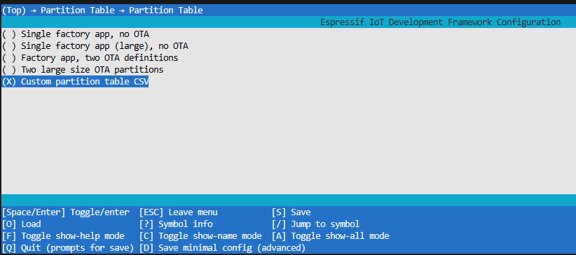
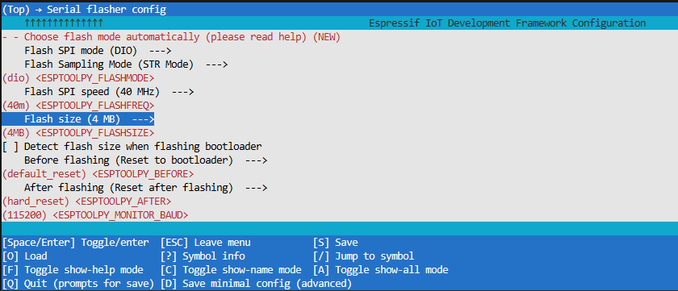

# ESP-IDFでWebSocket有効化
1. `idf.py menuconfig`
1. `[*] Enable WebSocket support`

# Request Header 拡張
1. `idf.py menuconfig`
1. 
- これをしないと一部のAndroidスマホからのレスポンスが「Header fields are too long」としてESPサーバが怒ってくる

# パーティションサイズ拡張
1. `idf.py menuconfig`
1. 
   ↓
   
   
1. 
- plotly.min.js（gzip圧縮で1.4MB）をアプリに乗せるために必要

# TODO
- captive portal
- スマホ、PC
- グラフ
- 3次元グラフ
- AP.NET両対応