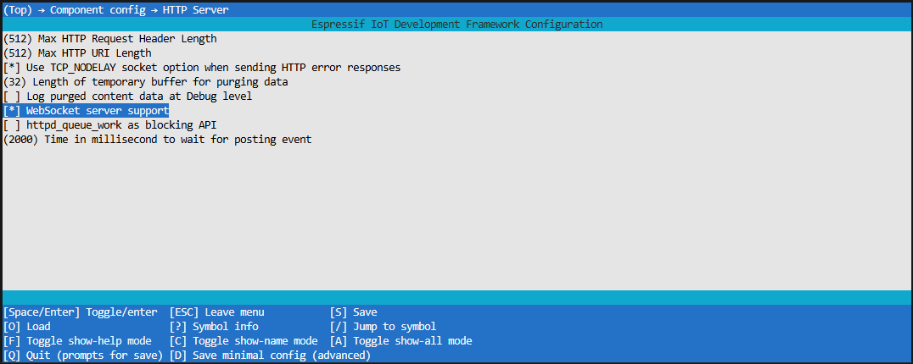
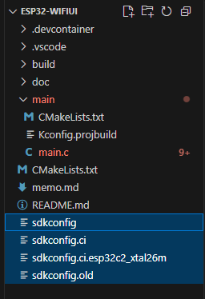
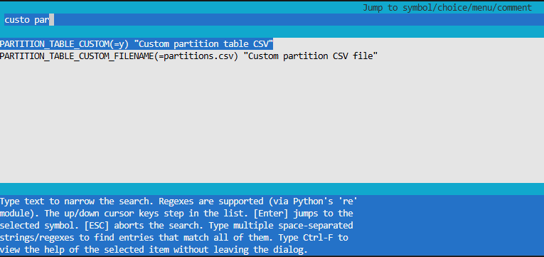

# WifiUIとは？
Wifi経由で開けるESP32のブラウザUIをそう呼ぶことにする
- スマホやPCを、ESP32のアクセスポイント（SSID: `esp32-<MACアドレス下6桁>`）に接続することでブラウザUIが自動で立ち上がる
- また、ESP32を子機として無線LANルータに接続し、ルーティングを適切に設定すれば、インターネットを経由して遠隔でブラウザUIを開くことも可能

## 開発環境
- VS Code
    - ESP-IDF V5.4.1 Extension (詳細はRADECHのドキュメント、もしくは[ESP32S3_helloworld](https://github.com/lelt0/ESP32S3_helloworld)を参照)  
    以下のモジュールを使用した。
        - [HTTP Server](https://docs.espressif.com/projects/esp-idf/en/stable/esp32/api-reference/protocols/esp_http_server.html)
        - [Wi-Fi](https://docs.espressif.com/projects/esp-idf/en/stable/esp32/api-reference/network/esp_wifi.html)
- ESP32
    無印もしくはS3で動作確認

# 内部仕様

## 全体構成

## キャプティブポータルを利用したブラウザの自動起動の仕組み

### キャプティブポータルとは？
特に公衆Wi-Fiなどのネットワークに接続したときに、インターネットアクセスの前にユーザーにログインや同意を求めるWebページを表示する仕組み。  
WifiUIではこのキャブティブポータルで自動でOSのミニブラウザが特定のURIにアクセスする仕組みを利用し、  
ユーザがIPアドレスを直接ブラウザに打ち込まなくてもESP32のUIにアクセスできる仕組みを作った

### 実装のポイント
Captive PortalはOSが自動的にインターネットへのアクセスを試行し、インターネット接続できなければリダイレクトされたページを(ミニ)ブラウザで表示する。  
つまり、基本的には
- ESP32内のDNSサーバで任意のドメインをESP32のアクセスポイントIPとして解決させること
- ESP32内のHTTPサーバで予期しないURIへのアクセスをすべて用意したポータルサイト（index.htmlなど）にリダイレクトすること  

ができればCaptive Portalを実現できる。

ただし、このインターネットアクセス試行先URLや「インターネットに繋がった」とみなす判定方法がOS（もしくはベンダー）ごとに異なるのがクセモノ。  
以下に自分のほうで調べたものも含め、各OSの挙動を示す。

- **Google Android, ChromeOSの場合（主にGoogle製のもの）：**  
`http://connectivitycheck.gstatic.com/generate_204`にアクセス可能かでインターネット接続を判定する。  
もしインターネット接続できている場合はこのページが`204 No Content`を返すので、その場合はキャプティブポータル無しと判断する。
    - **Samsungスマートフォン：**  
    これがクセが強く、リダイレクトするIPアドレスが192.168.xxx.xxxなどのprivate IPだとCaptive Portalと認識してくれず、「接続が不安定」などと表示されブラウザが自動で起動しない。  
    対策としてはpublicなIPアドレスを指定する必要がある。
        - しかし愚直にpublicなIPアドレスを指定すると、複数のNICを持つデバイスで1つのネットワークインターフェース（NI）でインターネットに、もうひとつのNIでESP32に接続した場合、publicなIPアドレスをネットにつながった方のNIで解決しようとするのでESP32のUIページに誘導できない問題がある。  
        （そもそもCaptivePortalはインターネットアクセスを承認するための仕組みなので、インターネットに接続できているならPortalページを開く必要がないのは正しい挙動なのだが…）
- **Apple macOS, iOS/iPadOSの場合（Apple製のもの）**  
`http://captive.apple.com/hotspot-detect.html`にアクセスして、  
`<HTML><HEAD><TITLE>Success</TITLE></HEAD><BODY>Success</BODY></HTML>`  
が返ってきたらキャプティブポータル無しと判断する。  
それ以外のコンテンツが返ってきたら、ブラウザを自動起動してそれを表示する
- **Microsoft Windowsの場合**  
    - **Windows10,11**  
    `http://www.msftconnecttest.com/connecttest.txt`にアクセスして、文字列`Microsoft Connect Test`が返った場合は、キャプティブポータル無しと判断する。  
    異なるコンテンツが返ってきたら、`http://www.msftconnecttest.com/redirect`にアクセスしてそのコンテンツを表示する。  
        - なお、WindowsにはNetwork Connectivity Status Indicator (NCSI) という仕組みがあり、これが20～30秒間隔で`connecttest.txt`にアクセスしてくるので、ポータルページを開いているときは定期的にアクセスログが出てくる
        - また、プロキシサーバー自動検出のため、WindowsのWPAD機能が有効になっている場合は`http://wpad/wpad.dat`へ頻繁にアクセスしてくる。このアクセスがあまりにも多いとESP32がパニックになるので、`/wpad.dat`へのアクセスには**404**を返すといい
    - **Windows8.1以前**  
    上記`http://www.msftconnecttest.com/connecttest.txt`の代わりに`http://www.msftncsi.com/ncsi.txt`を用いる[らしい](https://learn.microsoft.com/ja-jp/troubleshoot/windows-client/networking/internet-explorer-edge-open-connect-corporate-public-network)  
- **FireFox**  
Firefoxの独自実装として、`http://detectportal.firefox.com/success.txt`にアクセスしてステータス200で文字列`success`が返ればポータルなしと判断する。

上記のように各OSごとにCaptivePortalの挙動が異なるのはやはり問題視されているようで、
2020年に[RFC 8908](https://datatracker.ietf.org/doc/html/rfc8908)などで標準化された。  
しかし、2025年8月現在まだあまり普及していないらしく、今回のコードでも実装していない。

#### 参考ページ
- [espressif ESP-IDF公式のcaptive portalサンプル](https://github.com/espressif/esp-idf/tree/master/examples/protocols/http_server/captive_portal) ただし基本的なCaptivePortalのみの実装で、すべてのOSのCaptivePortalに対応しているわけではない
- [有志によるCaptivePortalの実装](https://github.com/CDFER/Captive-Portal-ESP32) ただしArduinoライブラリを使っており約700kBも使ってしまうので

## TODO
- captive portal
- スマホ、PC
- グラフ
- 3次元グラフ
- AP.NET両対応

# Get Started

## ビルド方法

1.  ESP-IDFでWebSocket有効化
    1. `idf.py menuconfig`
    1. `[*] Enable WebSocket support`
    
    

1. Request Header 拡張
    1. `idf.py menuconfig`
    1. 
    - これをしないと一部のAndroidスマホからのレスポンスが「Header fields are too long」としてESPサーバが怒ってくる

1. パーティションサイズ拡張
    1. `idf.py menuconfig`
    1. 
    ↓
    
    
    1. 
    - plotly.min.js（gzip圧縮で1.4MB）をアプリに乗せるために必要

